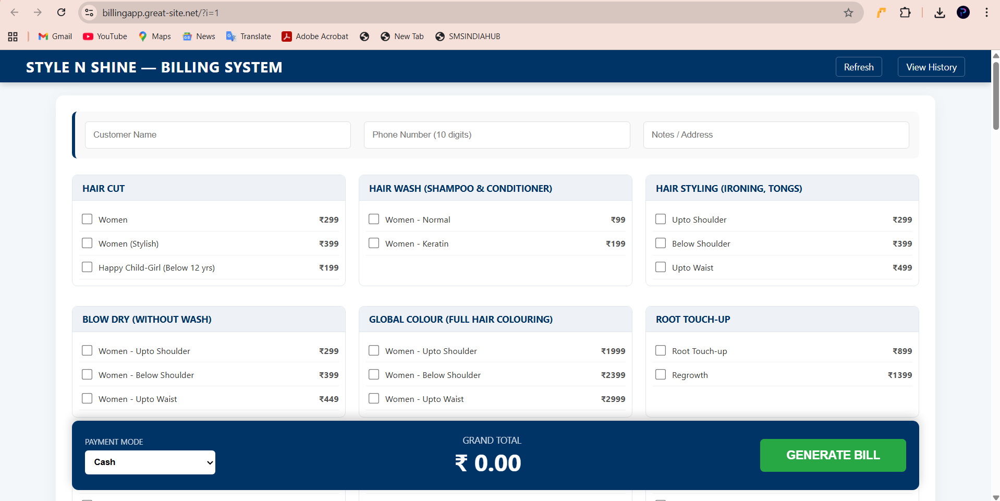
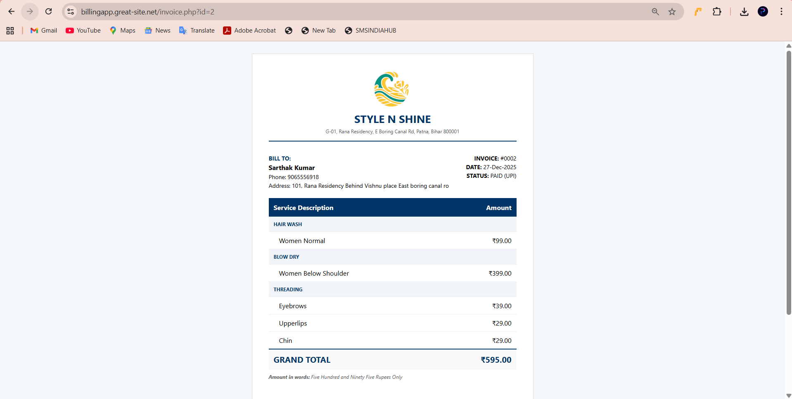
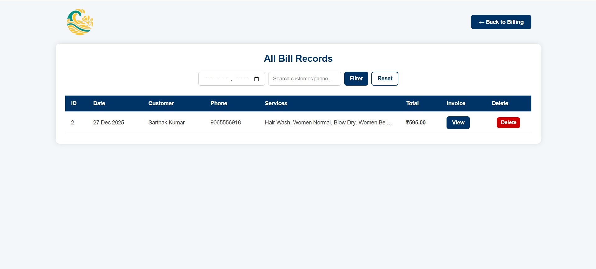

# 💇‍♂️ Style N Shine - Salon Billing System


A sleek, lightweight web-based billing solution tailored for **Style N Shine Salon**. This system automates the invoicing workflow, handles complex service calculations, and offers instant digital delivery via WhatsApp.

---

## 📸 Project Previews

### 1. Main Billing Dashboard



### 2. Professional Invoice Design



### 3. Veiw bills design



---

## 🚀 Key Features

* **Smart Invoicing:** Professional bill generation with automated numbering (`#0001`) and date tracking.
* **WhatsApp Integration:** Generates a high-quality snapshot of the bill and opens WhatsApp for instant sharing.
* **Auto-Amount to Words:** Built-in logic to convert the Grand Total into professional written text (e.g., *Five Hundred Rupees Only*).
* **Categorized Services:** Automatically groups salon services (Hair, Facial, Spa) for a clean, organized invoice.
* **Print Optimization:** Custom CSS ensures the invoice looks perfect when printed or saved as a PDF.
* **Authorized Signatory:** Professional footer section for official business stamps and signatures.

---

## 🛠️ Technical Stack

| Layer | Technology |
| :--- | :--- |
| **Frontend** | HTML5, CSS3 (Flexbox/Grid), JavaScript |
| **Backend** | PHP (MySQLi with Prepared Statements) |
| **Database** | MySQL (Relational Schema) |
| **Libraries** | [html2canvas](https://html2canvas.hertzen.com/) |

---

## 📦 Installation & Setup

1.  **Clone the Repository:**
    ```bash
    git clone https://github.com/Vibhav11Krishna/StyleNShine-Billing.git
    ```
2.  **Import Database:** Import the `database.sql` file provided into your **phpMyAdmin**.
3.  **Configure Connection:** Update your database credentials in `config.php`.

---

## 🌐 Live Website

Experience the live system here:  
👉 **[Style N Shine Billing Portal](https://billingapp.great-site.net/)**

---


**Developed with ❤️ for Style N Shine Salon.**